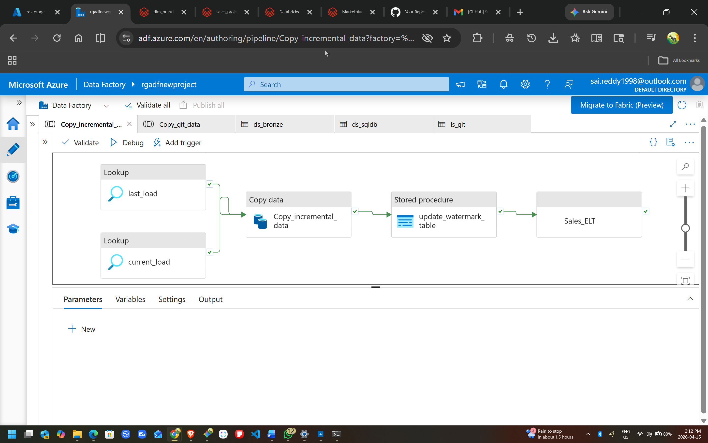

# End-to-End Azure Data Engineering Pipeline
### Medallion Architecture & Incremental Loading

## 🚀 Project Overview
This project demonstrates a production-ready, end-to-end data pipeline built on Microsoft Azure. It extracts raw data from GitHub, loads it into an Azure SQL Database, and orchestrates an incremental load into a Data Lake. Finally, the data is transformed through a Medallion Architecture (Bronze, Silver, Gold) using Azure Databricks to prepare it for downstream analytics.

## 🏗️ Architecture & Data Flow
 *(Note: Ensure your screenshot file is named pipeline_screenshot.png or update this link)*

1. **Initial Ingestion:** Raw data is fetched from a GitHub repository and loaded into an Azure SQL Database.
2. **Incremental Load (ADF):** Azure Data Factory uses a `Lookup` activity to read a watermark table, fetching only new or updated records from Azure SQL.
3. **Bronze Layer (Raw):** The incremental data is copied into Azure Data Lake Storage (ADLS Gen2) in its raw format.
4. **Silver Layer (Cleansed):** Azure Databricks (PySpark) reads the Bronze data, handles null values, enforces schema, and writes it back to ADLS in Delta format.
5. **Gold Layer (Curated):** Databricks performs business aggregations and joins to create the final reporting tables.
6. **State Management:** Upon successful completion, a Stored Procedure updates the watermark table with the latest processing timestamp.

## 🛠 Tech Stack
* **Orchestration:** Azure Data Factory (ADF)
* **Compute:** Azure Databricks (PySpark / Spark SQL)
* **Storage:** Azure Data Lake Storage Gen2 (ADLS Gen2)
* **Database:** Azure SQL Database
* **Version Control:** GitHub

## 🌟 Key Engineering Practices Highlighted
* **Medallion Architecture:** Clear logical separation of data states (Bronze, Silver, Gold) utilizing Delta Lake capabilities.
* **Incremental Data Loading:** Designed a robust watermarking system (table + stored procedure) to process only new records, optimizing compute time and costs.
* **Parameterization:** Implemented dynamic datasets in ADF using parameters, allowing a single pipeline structure to handle multiple tables dynamically.
* **Security Best Practices:** Configured Linked Services to rely on Azure Key Vault references rather than hardcoded credentials.

## 📂 Repository Structure
* `/adf` - Contains the JSON definitions for Pipelines, Datasets, and Linked Services.
* `/databricks` - Contains the PySpark/Jupyter Notebooks for Silver and Gold layer transformations.
* `/sql_scripts` - Contains the DDL for the Watermark table and the state-updating Stored Procedure.
* `/images` - Architecture diagrams and control flow screenshots.
